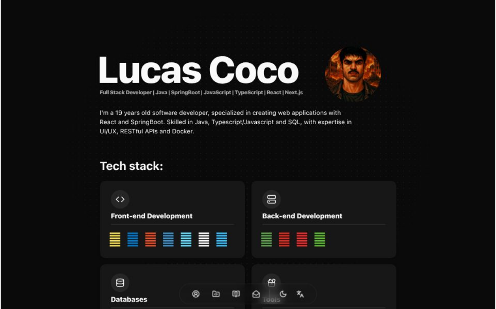

# My Portfolio




***Para uma versão do README em português, clique*** [aqui](https://github.com/coco-lucas/portifolio/edit/master/README.md#portugu%C3%AAs).

---

## English

This is my personal portfolio website built with **React** and **TypeScript**, designed to showcase my projects, skills, and tech stack, as well as provide a simple way for developers, companies, and clients to contact me for potential work or collaborations.

The project also served as a learning experience, with several modern libraries and tools, focusing on UI/UX, animations, internationalization and a clean code.

<details>
  <summary> 📂Project folder structure: </summary>

  ```
    public/
    │
    ├── locales/  #i18n translation files for all supported languages
    │ ├── en/
    │ │ └── home.json
    │ ├── es/
    │ │ └── home.json
    │ └── pt/
    │ └── home.json
    
    src/
    │
    ├── assets/  #Static assets such as images and icons
    │ ├── projects/  #Projects-specific images (organized per project)
    │ │ ├── orangeHUB/
    │ │ │ ├── home.jpeg
    │ │ │ ├── services.jpeg
    │ │ │ └── svps.jpeg
    │ │ └── tere-verde/
    │ │ ├── mobile/
    │ │ │ ├── eventos.png
    │ │ │ ├── home.png
    │ │ │ └── navbar.png
    │ │ └── pc/
    │ │ ├── eventos.png
    │ │ ├── filtro-bio.png
    │ │ ├── home.png
    │ │ ├── saiba-mais-trilhas.png
    │ │ ├── trilhas.png
    │ │ └── vlibras-home.png
    │ ├── icon.png
    │ ├── lucas-coco-ai.png
    │ ├── lucas-coco.jpeg
    │ └── og-image.png
    │
    ├── components/  #All React components (custom + adapted shadcn/ui)
    │ ├── contact/ 
    │ │ ├── form.tsx
    │ │ └── index.tsx
    │ ├── dock/ 
    │ │ ├── index.tsx
    │ │ ├── language-changer.tsx
    │ │ └── theme-toogle.tsx
    │ ├── education/ 
    │ │ ├── card.tsx
    │ │ └── index.tsx
    │ ├── project/ 
    │ │ ├── card.tsx
    │ │ ├── carousel.tsx
    │ │ ├── index.tsx
    │ │ └── tabs.tsx
    │ ├── social/ 
    │ │ └── index.tsx
    │ ├── tech-stack/ 
    │ │ ├── card.tsx
    │ │ └── index.tsx
    │ └── ui/  #All installed shadcn/ui components
    │ ├── badge.tsx
    │ ├── button.tsx
    │ ├── card.tsx
    │ ├── carousel.tsx
    │ ├── dialog.tsx
    │ ├── dropdown-menu.tsx
    │ ├── form.tsx
    │ ├── image.tsx
    │ ├── input.tsx
    │ ├── label.tsx
    │ ├── select.tsx
    │ ├── separator.tsx
    │ ├── skeleton.tsx
    │ ├── tabs.tsx
    │ ├── textarea.tsx
    │ └── tooltip.tsx
    │
    ├── lib/  #Utility and provider functions
    │ ├── observer-provider.tsx
    │ ├── theme-provider.tsx
    │ └── utils.ts
    │
    ├── pages/
    │ └── home.tsx
    │
    ├── App.tsx  #Main application component
    ├── globals.css  #Global styles
    ├── main.tsx  #Application entry point
    └── vite-env.d.ts
    
    ...other files
  ```
</details>


## 🎨Features

- **Contact Form**
  - Integrated with [EmailJS](https://www.emailjs.com/) to send personalized messages directly from the site.

- **Responsive Design**
  - Made with tailwind using a mobile first aprouch, for optimized desktop and mobile experience.

- **Animations**
  - Smooth motions using [Rombo](https://rombo.co/) CSS-based animations.

- **Internationalization**
  - Supports English, Portuguese, and Spanish using [i18next](https://www.i18next.com/) with [i18nexus](https://i18nexus.com/) dashboard.

- **Component Library**
  - Built with [shadcn/ui](https://ui.shadcn.com/) for consistent and modern UI.


## ⚙️Installation & Setup

1. **Clone the repository**
   ```bash
   git clone https://github.com/coco-lucas/portifolio.git
   cd portifolio
   ```
2. **Install dependencies**
   ```
    npm install
   ```
3. **Configure environment variables**
   
   Create a .env file at the $root and add:
   ```
   VITE_EMAILJS_SERVICE_ID=your_service_id
   VITE_EMAILJS_TEMPLATE_ID=your_template_id
   VITE_EMAILJS_PUBLIC_KEY=your_public_key

   VITE_EMAILJS_CONTACT_EMAIL=your_contact_email  #This will be the email that will apear if EMAILJS API is down.
   ```
2. **Finally, run locally**
   ```
    npm run dev
   ```

---

## Português

Este é o meu site pessoal de portfólio construído com React e TypeScript, projetado para mostrar meus projetos, habilidades e stack tecnológico, além de oferecer uma forma simples para desenvolvedores, empresas e clientes entrarem em contato comigo para possíveis trabalhos ou colaborações.

O projeto também serviu como experiência de aprendizado, utilizando diversas bibliotecas e ferramentas modernas, com foco em UI/UX, animações, internacionalização e código limpo.
<details> 
  <summary> 📂Estrutura das pastas do projeto: </summary>

  ```
   public/
  │
  ├── locales/  #Arquivos de tradução i18n para todos os idiomas suportados
  │ ├── en/
  │ │ └── home.json
  │ ├── es/
  │ │ └── home.json
  │ └── pt/
  │ └── home.json
  
  src/
  │
  ├── assets/  #Recursos estáticos como imagens e ícones
  │ ├── projects/  #Imagens específicas dos projetos (organizadas por projeto)
  │ │ ├── orangeHUB/
  │ │ │ ├── home.jpeg
  │ │ │ ├── services.jpeg
  │ │ │ └── svps.jpeg
  │ │ └── tere-verde/
  │ │ ├── mobile/
  │ │ │ ├── eventos.png
  │ │ │ ├── home.png
  │ │ │ └── navbar.png
  │ │ └── pc/
  │ │ ├── eventos.png
  │ │ ├── filtro-bio.png
  │ │ ├── home.png
  │ │ ├── saiba-mais-trilhas.png
  │ │ ├── trilhas.png
  │ │ └── vlibras-home.png
  │ ├── icon.png
  │ ├── lucas-coco-ai.png
  │ ├── lucas-coco.jpeg
  │ └── og-image.png
  │
  ├── components/  #Todos os componentes React (customizados + adaptados shadcn/ui)
  │ ├── contact/ 
  │ │ ├── form.tsx
  │ │ └── index.tsx
  │ ├── dock/ 
  │ │ ├── index.tsx
  │ │ ├── language-changer.tsx
  │ │ └── theme-toogle.tsx
  │ ├── education/ 
  │ │ ├── card.tsx
  │ │ └── index.tsx
  │ ├── project/ 
  │ │ ├── card.tsx
  │ │ ├── carousel.tsx
  │ │ ├── index.tsx
  │ │ └── tabs.tsx
  │ ├── social/ 
  │ │ └── index.tsx
  │ ├── tech-stack/ 
  │ │ ├── card.tsx
  │ │ └── index.tsx
  │ └── ui/  #Todos os componentes shadcn/ui instalados
  │ ├── badge.tsx
  │ ├── button.tsx
  │ ├── card.tsx
  │ ├── carousel.tsx
  │ ├── dialog.tsx
  │ ├── dropdown-menu.tsx
  │ ├── form.tsx
  │ ├── image.tsx
  │ ├── input.tsx
  │ ├── label.tsx
  │ ├── select.tsx
  │ ├── separator.tsx
  │ ├── skeleton.tsx
  │ ├── tabs.tsx
  │ ├── textarea.tsx
  │ └── tooltip.tsx
  │
  ├── lib/  #Funções utilitárias e providers
  │ ├── observer-provider.tsx
  │ ├── theme-provider.tsx
  │ └── utils.ts
  │
  ├── pages/
  │ └── home.tsx
  │
  ├── App.tsx  #Componente principal da aplicação
  ├── globals.css  #Estilos globais
  ├── main.tsx  #Ponto de entrada da aplicação
  └── vite-env.d.ts
  
  ...outros arquivos
  ```
</details>

## 🎨Recursos
- **Formulário de Contato** 
  - Integrado com [EmailJS](https://www.emailjs.com/) para enviar mensagens personalizadas diretamente do site.
    
- **Design Responsivo**
  - Feito com tailwind usando uma abordagem mobile first, para experiência otimizada em desktop e mobile.

- **Animações**
  - Movimentos suaves usando animações baseadas em CSS do [Rombo](https://rombo.co/).

- **Internacionalização**
  - Suporta Inglês, Português e Espanhol usando [i18next](https://www.i18next.com/) com painel [i18nexus](https://i18nexus.com/).

- **Biblioteca de Componentes**
  - Construída com [shadcn/ui](https://ui.shadcn.com/) para UI consistente e moderna.
  

## ⚙️ Instalação e Configuração
1. **Clone o repositório**
   ```bash
   git clone https://github.com/coco-lucas/portifolio.git
   cd portifolio
   ```
2. **Instale as dependências**
   ```
    npm install
   ```
3. **Configure as variáveis de ambiente**
   
   Crie um arquivo .env na $raiz e adicione:
   ```
   VITE_EMAILJS_SERVICE_ID=seu_service_id
   VITE_EMAILJS_TEMPLATE_ID=seu_template_id
   VITE_EMAILJS_PUBLIC_KEY=sua_chave_publica
   VITE_EMAILJS_CONTACT_EMAIL=seu_email_de_contato  #Este será o email que aparecerá se a API do EMAILJS estiver fora do ar.
   ```
2. **Por fim, execute localmente**
   ```
    npm run dev
   ```
